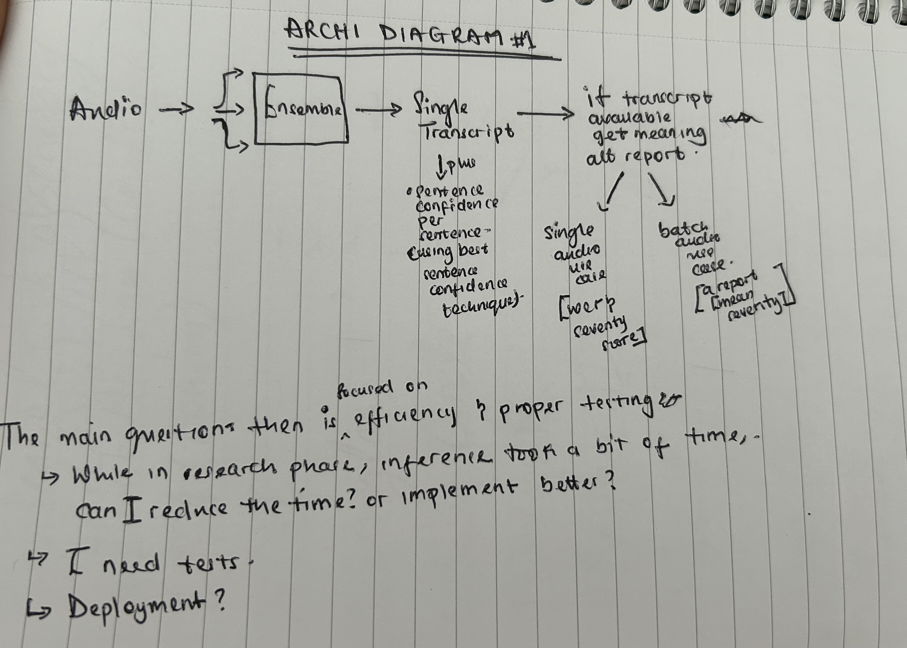
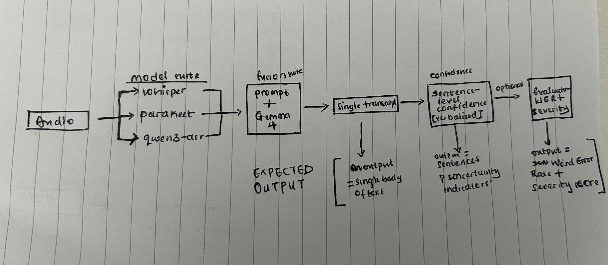

# asr-fusion-eval-pipeline
A production-focused implementation of the ASR ensemble and evaluation pipeline developed during my MPhil research in collaboration with Police Scotland.

The main components of this repo are:
1. The implemented best ensemble method - LLM Unanchored fusion.
2. Implementation of the best sentence-confidence technique I found.
3. The meaning-alteration evaluation - for if the transcript of the audio is available.
4. The end-to-end run, with proper tests and efficiency improvements.

## Pipeline diagram 

### Version #1 with motivations
This diagram shows the simple form of the pipeline alongside the motivations/questions that encouraged me to create a separate usable/testable repo.

  

### Version #2 - a bit clearer
This shows a clearer separation of concerns.

  

## Design decisions (Some carried over from the research repo)
1. Chunking the audio for Whisper and Parakeet due to context window limits. This was already implemented in Qwen3-ASR.
2. Another was deciding either to run on float16 (for gpu) or int8 for cpu.